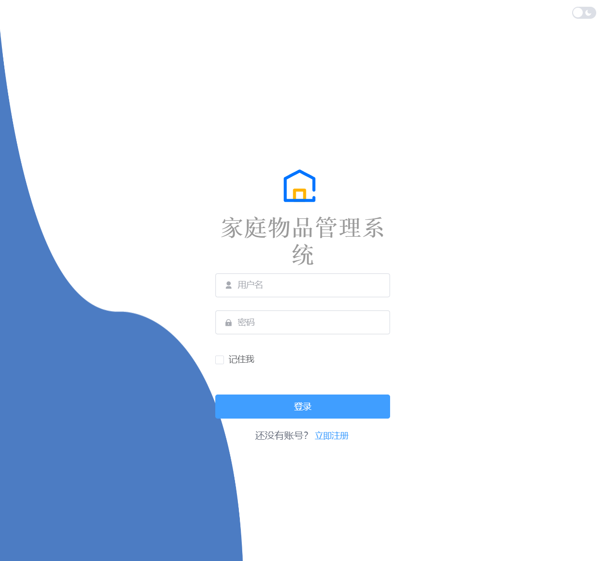
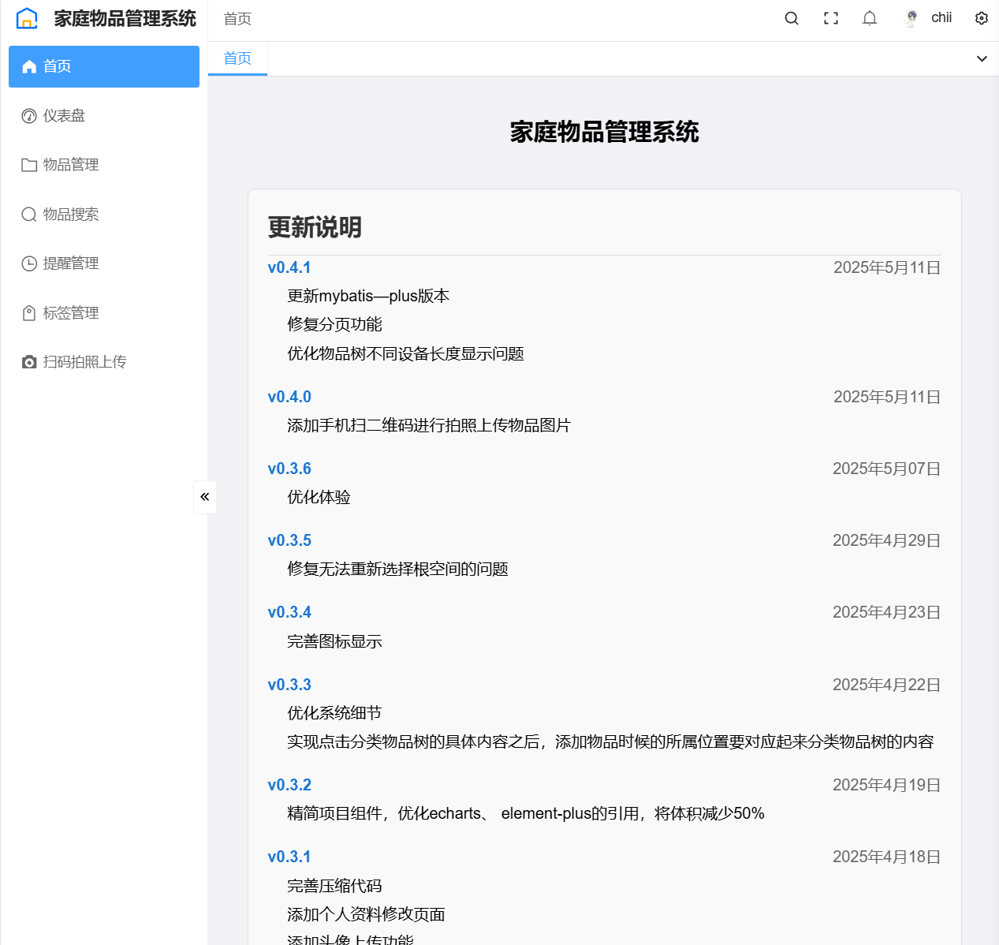
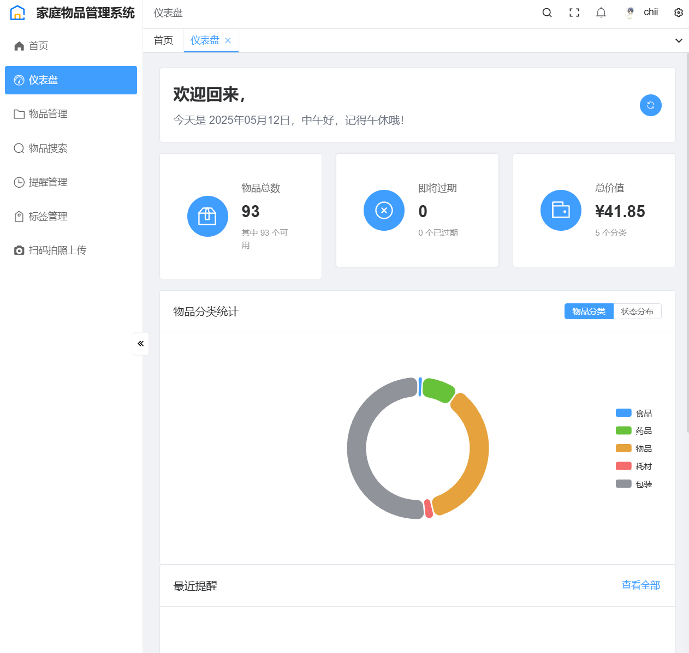
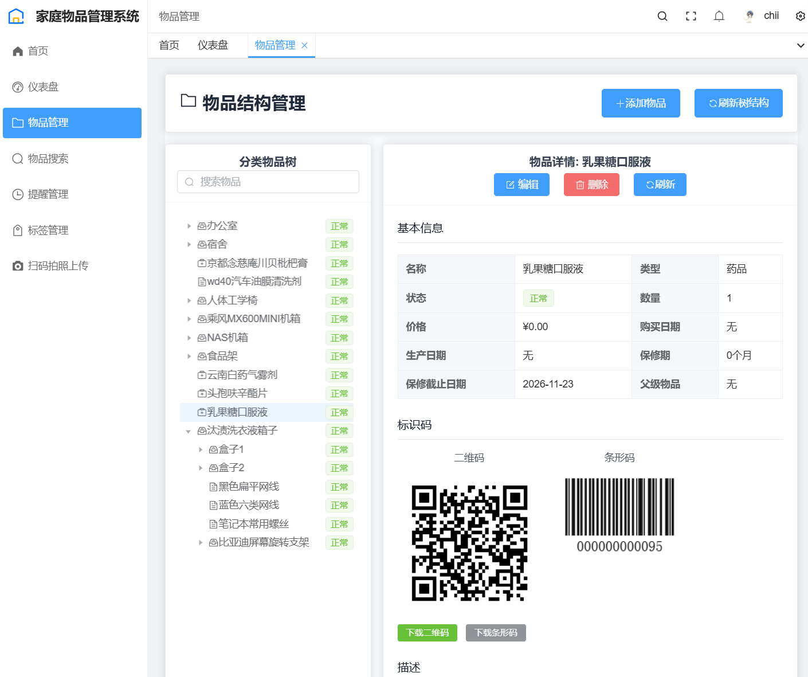
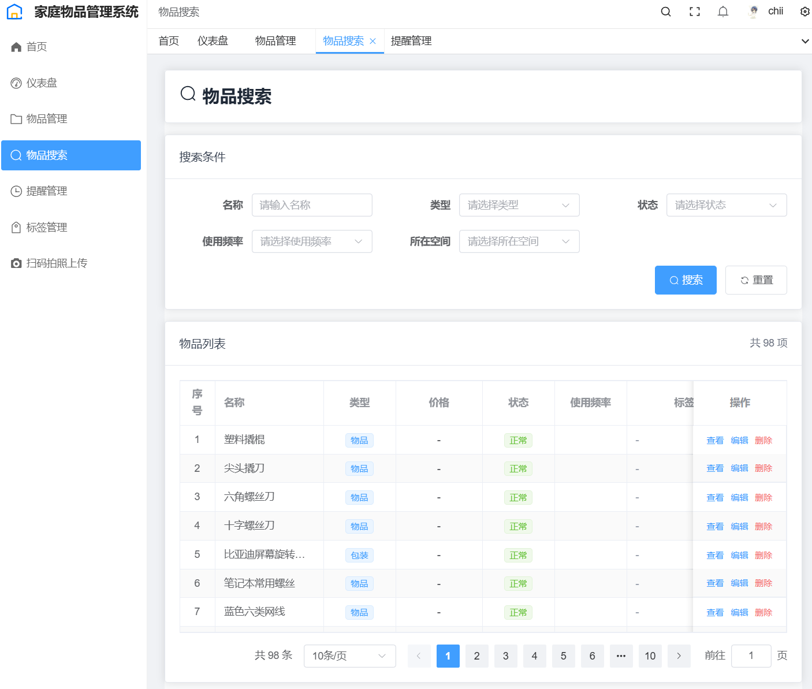
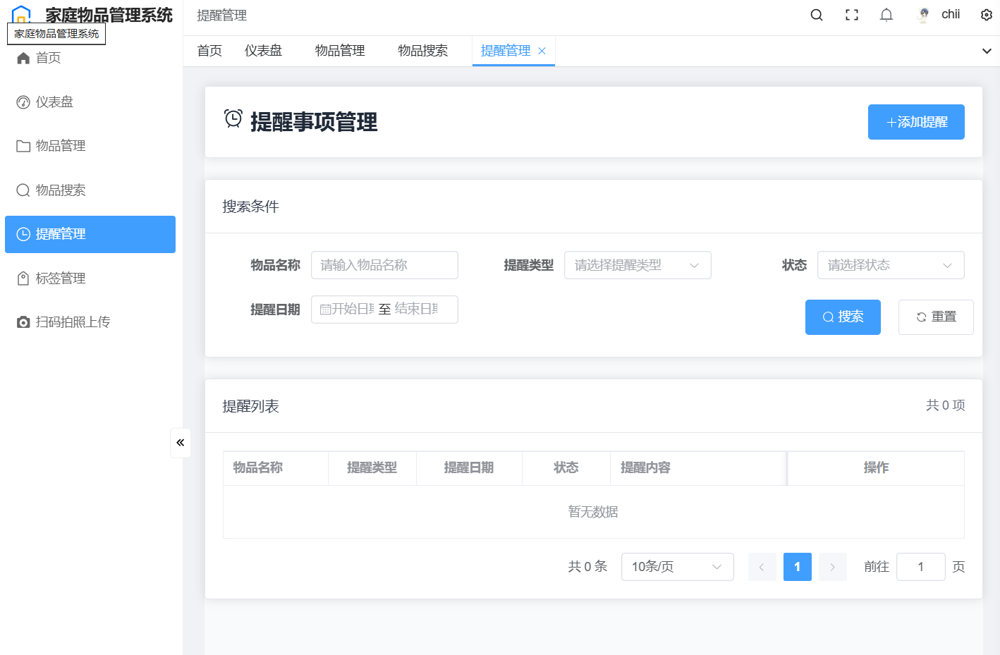
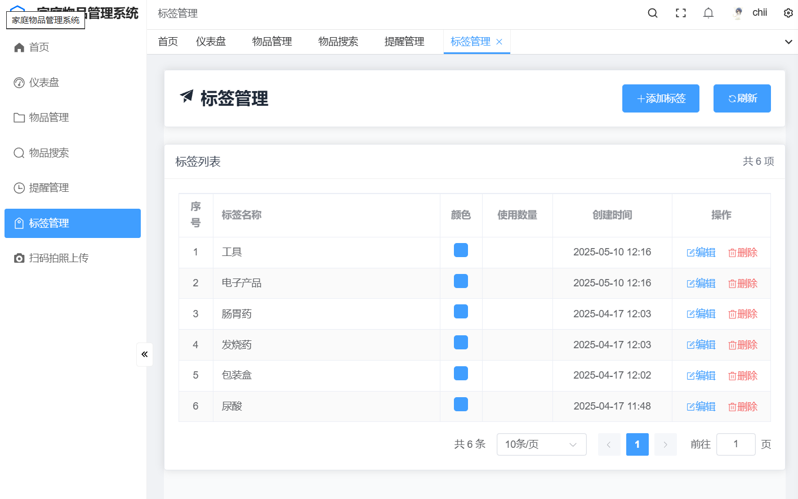

# 家庭管理系统设计文档

## 1. 系统概述

家庭管理系统（Home Management System）是一个综合性家庭事务管理平台，旨在帮助用户高效管理家庭物品和空间信息。

**主要特点**：
- 前后端分离架构
- 后端：Java Spring Boot技术栈
- 前端：Vue3 + TypeScript开发
- 专注于家庭物品管理
- 支持标签、分类和层级结构

## 2. 技术架构

### 2.1 后端架构

| 组件 | 技术选型 |
|------|----------|
| 开发语言 | Java 21 |
| 框架 | Spring Boot 3.2.x |
| 数据库 | MySQL 8.0 |
| ORM框架 | MyBatis-Plus |
| API风格 | RESTful |
| 日志系统 | Log4j2, Slf4j |
| 安全框架 | Spring Security (JWT) |
| API文档 | SpringDoc (OpenAPI 3) |
| 参数验证 | Jakarta Validation |
| 图片处理 | libavif (AVIF格式转换) |

### 2.2 前端架构

| 组件 | 技术选型 |
|------|----------|
| 框架 | Vue3 |
| 开发语言 | TypeScript |
| 构建工具 | Vite |
| UI组件库 | Element Plus |
| 状态管理 | Pinia |
| 路由 | Vue Router |
| HTTP客户端 | Axios |
| CSS框架 | Tailwind CSS |
| 国际化 | Vue I18n |
| 图表库 | ECharts |

**相关文档**：
1. [系统设计文档.md](%CF%B5%CD%B3%C9%E8%BC%C6%CE%C4%B5%B5.md)
2. [项目结构.md](%CF%EE%C4%BF%BD%E1%B9%B9.md)

## 3. 版本更新历史

| 版本 | 日期 | 更新内容 |
|------|------|----------|
| v0.4.1 | 2025-05-11 | - 更新MyBatis-Plus版本 - 修复分页功能 - 优化物品树在不同设备的显示长度 |
| v0.4.0 | 2025-05-11 | 添加手机扫码拍照上传物品图片功能 |
| v0.3.6 | 2025-05-07 | 优化用户体验 |
| v0.3.5 | 2025-04-29 | 修复无法重新选择根空间的问题 |
| v0.3.4 | 2025-04-23 | 完善图标显示 |
| v0.3.3 | 2025-04-22 | - 优化系统细节 - 实现分类物品树与添加物品的联动 |
| v0.3.2 | 2025-04-19 | - 精简项目组件 - 优化echarts和element-plus引用，体积减少50% |
| v0.3.1 | 2025-04-18 | - 完善代码压缩 - 添加个人资料修改页面 - 添加头像上传功能 |
| v0.3.0 | 2025-04-17 | 通过libavif实现图片高效压缩为AVIF格式 |
| v0.2.1 | 2025-04-16 | 添加物品数量属性 |
| v0.2.0 | 2025-04-16 | - 重构前端功能 - 分离常用功能函数 - 图片改为URL显示，后端图片保存到文件系统 |
| v0.1.4 | 2025-04-15 | 完善仪表盘功能和数据显示 |
| v0.1.3 | 2025-04-14 | - 优化token管理 - 优化用户信息管理 - 完善物品管理图片功能 |
| v0.1.2 | 2025-04-14 | 优化物品管理的表单选项样式 |
| v0.1.1 | 2025-04-14 | 优化axios请求 |
| v0.1.0 | 2025-04-13 | - 新增物品搜索详情页 - 新增物品编辑页 - 删除mock数据